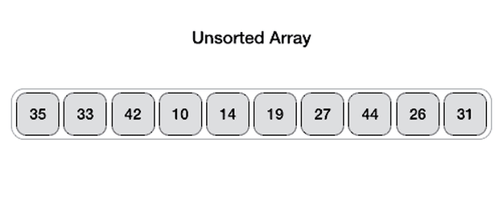

# Métodos de ordenação e busca

============

Algoritmo feito como trabalho na materia de `Algoritmos e Estrutura de Dados 2`.

Esse algoritmo ira aplicar os métodos de ordenação e busca em um vetor de 10000 posições que foi gerado aleatoriamente usando a função [rand()](http://linguagemc.com.br/valores-aleatorios-em-c-com-a-funcao-rand/).

## Sobre o Aplicativo

* Feito em Linguagem C+
* Plataforma Windows
* Compilador [GCC](https://sourceforge.net/projects/mingw/files/)
* IDE Code: [Visual Studio Code](https://code.visualstudio.com/)

## 1. Ordenação por Seleção: Selection Sort

Nesse algoritmo sempre definimos o elemento minimo atual como o primeiro elemento na partição não classificada, progredimos no comprimento da matriz procurando por um número menor, ao encontrarmos esse menor valor definimos como o nosso mínimo atual e então trocamos os dois valores. E agora temos um novo item na nossa partição não classificada. Seguindo em frente definimos o segundo valor que está na posição seguinte como o nosso mínimo atual e repetimos o processo de escanear toda as posições da matriz em busca do menor valor comparado com o nosso novo valor que está na posição atual, a o encontrar o menor valor as posições são trocadas e isso segue até que todo o array esteja ordenado. Daí vem o nome busca por seleção, o algoritmo seleciona um elemento e faz o comparativo com todos os outros elementos e troca a posição dependendo de como está a sua condição, você pode configurar para ordenar tanto em ordem decrescente como crescente.

## 2. Ordenação por Flutuação: Bubble Sort

Nesse algoritmo vamos comparar itens exclusivos e ver se eles estão fora do lugar se estiverem nós iremos trocar os intens de posição. O valor mais alto ira para a direita com cada interação e assim sucessivamente até que uma partição classificada se formara no final da matriz. Até que toda nossa matriz esteja ordenada.

## 3. Ordenação por Inserção: Insertion Sort

Aqui iremos pegar uma matriz onde queremos classificá-la em ordem crescente, iremos começar pela esquerda e seguiremos para a direita o algoritmo ira examinar cada item e compará-lo com os itens à sua esquerda e então irá inserir na posição correta da matriz. Parte da nossa matriz será classificada conforme formos progredindo.
  
O primeiro item não a outro item a esquerda então é marcado como classificado, passando para o proximo comparamos com o primeiro se caso for menor fazemos a troca e marcamos como classificado, sabemos que o proximo item pode ser maior ou menor do que o item a esquerda comparamos e trocamos até que ele esteja na posição correta e então marcamos como classificado, e assim progressivamente até que toda nossa matriz esteja ordenada.

## 4. Ordenação por Mistura: Merge Sort

Nesse algoritmo iremos mesclar e selecionar alguns pontos rápidos. O *mergesort* é um algoritmo recursivo onde o seu ideal é **dividir para conquistar** nós iremos dividir nosso problema em problemas menores, a fim de resolvê-lo.

Temos um array que queremos que seja ordenado. Vamos dividir continuamente a matriz pela metade até que todos os itens estejam sozinhos, e então vamos pegar esses itens individuais/sozinhos e comparar seus valores e mesclar em matrizes temporárias de dois elementos, até que todos os raios temporários estejam classificados. Agora vamos pular para nossa pilha de recursão e continuar, iremos mesclar nossos arrays menores em arrays maiores inserindo os itens na ordem correta. Essas fusões irão continuar até que todo o nosso array esteja ordenado. Daí o nome Merge Sort: Mescla ordenada ou Mistura ordenada.

## 5. Ordenação Rápida: Quick Sort

O algoritmo de QuickSort como o MergeSort também é recursivo, porém quando você pensa em quicksort quero que pense na palavra **pivô**. Um **pivô** é simplesmente um dos itens na matriz que significa o elemento principal seguindo três condições depois de classificá-lo primeiro. O pivô está em sua posição correta na matriz final classificada, isso significa que todos os itens para a esquerda são menores e todos os itens à direita são maiores.

Somos solicitados a classificar uma matriz, então vamos escolher um pivô e move-lo para o final da matriz em seguida, vamos procurar dois itens a esquerda, que é o primeiro item no array começando da esquerda que deve ser maior que nosso segundo item da direita que é o primeiro item apartir da direita menor que nosso pivô.
Começando com o primeiro item podemos ver que o valor é maior do que o valor do nosso pivo, agora começando pela direita, vemos que o valor do item a direita é menor, então vamos trocar o item da esquerda com o item da direita repetimos o processo desta vez com o item a seguir até vermos que o item da esquerda tem um índice maior do que o item da direita, então sabemos que terminamos. Então trocamos o item da esquerda com o nosso pivô. Nosso pivô agora esta no meio e vemos que os itens a esquerda são menores e os itens a direita são maiores. Dissemos que o quicksort é recursivo pois agora a duas partes de um lado valores menores e de outro valores maiores e isso acontece progressivamente até que todos os valores da matriz estejam ordenados.

Uma questão importante é como escolhemos o pivô que torna um grande diferencial no desempenho do algoritmo, pois queremos escolher um pivô que divida a matriz ao meio ou o mais próximo possível para equilibrar o trabalho um método popular é chamado de *encontro de três* neste método olhamos para o primeiro, meio e último elemento da matriz nós os classificamos corretamente e escolhemos o item do meio como nosso pivô que estamos fazendo a suposição de que o meio desses três itens pode estar perto da mediana de todo o array.

# Notas
Vale a pena utilizar o [visualgo](https://visualgo.net/pt/sorting) para visualizar a execução dos algoritmos de ordenação.

=====================

## Busca Sequencial

Um jeito simples de fazer uma busca é percorrer o nosso array de posição por posição e verificar se o número que está lá dentro é o número que estamos procurando e o nome desse procedimento é **busca sequencial**. Busca de elemento por elemento.

O resultado desse algoritmo pode ser um valor booleano ou pode ser a posição em que o elemento estava ou se não encontrou retornar "não encontrado" ou false.

## Busca Binária

Por princípio depois que temos nosso array ordenado iremos olhar para o elemento do meio e comparar com o elemento que está sendo buscado. Se caso o elemento for o que estamos buscando o programa encerrará se não for o algoritmo ira verificar se o elemento x que está sendo buscado é maior ou menor que esse elemento do meio se for maior ele ira buscar apartir do lado direito se caso for menor ira buscar apartir do lado esquerdo. E esse processo ira se repetir a cada interação sucessivamente até só sobrar um elemento a ser comparado e assim comparar se o elemento y encontrado é igual o elemento x que estamos procurando.

